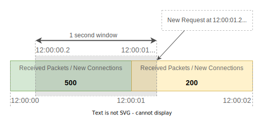
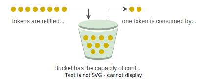
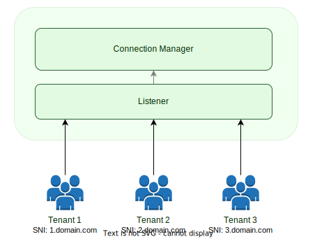
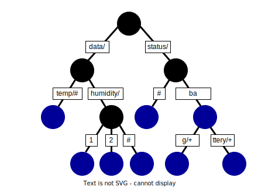

# System Design

> **_NOTE:_**  Consider this document as a draft.

## Overview

The MQTT protocol is the de-facto standard for IoT messaging. Standardized by OASIS and ISO, MQTT protocol provides a
scalable and reliable way to connect devices over the Internet. Today, MQTT is used by many companies to connect
millions of devices to the Internet.

The MQTT protocol is an extremely simple and lightweight messaging protocol designed for limited devices and networks
with high latency, low bandwidth or unreliable networks. It is designed to reduce the network bandwidth and resource
requirements of devices. Using the MQTT protocol, resource-constrained IoT devices can send information to a server, by
publishing on a specific topic, that acts as an MQTT message broker. The broker then transmits the information to those
who have previously subscribed to that topic.

MaxMQ is an open-source, cloud-native, and high-performance message broker for IoT, compliant with the MQTT 3.1, 3.1.1
and 5.0 specifications. In order to be a production-grade message broker, the following characteristics are required:

- **High Availability:** The system must have low latency and maintain highly available for any operations even if one
  or more nodes are in a failure state, or if there's a network failure
- **High Scalability:** The system must scale both vertically (make use of modern multicore, multi-CPU architectures,
  and high-capacity storage devices), as well as horizontally (adding more nodes)
- **High Performance:** The system must run as close to the hardware as possible to deliver low and consistent latency
  as well as very high throughput
- **High Maintainability:** The system must be easy to operate with easy-to-use features that require minimal initial
  configuration

## Architecture

The architecture of the MaxMQ is divided into different services, where each service is responsible for a group of
functionalities related to a given context. The current architecture contains four services:

- **MQTT Server:** Acts as a front door for MQTT clients, allowing those clients to connect using the MQTT protocol
- **API Server:** Provides an interface to allow external applications to interact with the message broker
- **Rule Engine:** Processes received data in real-time, which can extract, filter, enrich, transform, and store those
  data
- **Storage Node:** A high-performance and highly-available distributed Key-Value store

Those services can be deployed all together in a single process, as a monolithic application, or they can be deployed
each service in a separate process, as microservices, to allow each service to scale independently.

The communication between each service are internal API calls, when the caller and the called services are in the same
process, or Remote Procedure Call (RPC) otherwise.

### MQTT Server

The MQTT server is a message broker fully compatible with the MQTT 3.1, 3.1.1 and 5.0 specifications. The MQTT server
implements a layered architecture which contains three layers: Connection, Session, Routing.

#### Connection Layer

The connection layer is responsible for:

- Listen and accept TCP connections
- Read (deserialize) MQTT packets from clients
- Send (serialize) MQTT packets to clients
- Connection management
- Rate limiting
- Identity and Access Management (IAM)

The MQTT server supports four listeners:

- TCP
- WebSocket
- TLS
- Secure WebSocket

The TCP and WebSocket listeners send and receive data through an unencrypted channel, while the TLS and Secure
Websockets use the SSL/TLS protocol to encrypt the messages in-transit. When using the server in multi-tenant mode,
only the TLS and Secure WebSocket listeners are available.

The connection layers applies four different rate limiting with configured thresholds:

- Number of concurrent connection
- Connection rate
- Received bytes rate
- Received MQTT PUBLISH packets rate

The rate limiting for connection rate and received MQTT PUBLISH packets rate use the Sliding Window Counter algorithm,
as shown in the image bellow:

When the server receives a new connection request, or a new MQTT PUBLISH packet, it verifies the rate based on the
sliding window, and rejects the request/packet if the rate is above the configured threshold.

The rate limiting of the received bytes rate uses the Token Bucket algorithm, as shown in the image bellow:

When the server received a new packet, the server verifies if the bucket contains enough token for the packet.
If the packet size, in bytes, is bigger than the number of tokens available in the bucket, the packet is rejected.

The connection layer is also responsible for Identity and Access Management. When MQTT clients connect with the server,
the server authenticates those clients before any operation. The server supports the following authentication methods:

- **Username/Password:** The server validates the username/password provided in the MQTT CONNECT packet
- **Server certificate:** The server validates if the X.509 certificate used to establish the TLS connection matches
  with the server certificate
- **Client certificates:** The server validates if the X.509 certificate used to establish the TLS connection is a valid
  client certificate

The server and client certificate authentication methods are available only for TLS and Secure WebSocket listeners.

The connection layer is also responsible for tenant identification, when the server is configured in multi-tenant mode.
To identify the tenant, the server uses the Server Name Indicator (SNI) from the TLS protocol, as shown in the image
bellow:

Once the tenant is identified during the connection process, each tenant is isolated of each other through namespaces.
Each namespace contains all information related to associated tenant.

#### Session Layer

The session layer is responsible for:

- Handle the received MQTT packets
- Deliver the MQTT PUBLISH packet to MQTT clients
- Session management

Based on the MQTT specifications, when the client finishes the connection process, a session is created on the server.
This session is kept in memory until the network connection is closed. When the session is created without the
CleanSession flag set, the session is also stored in the [Storage Node](#storage-node) until the client sends the
DISCONNECT packet, or the session expires.

The table bellow shows the attributes and their respective types of a session. Please note that this is a simplified
version, and it only includes the most important attributes.

| Attribute         | Description                                                                                   | Type   |
|-------------------|-----------------------------------------------------------------------------------------------|--------|
| Session ID        | Session identifier generated by the server                                                    | uint64 |
| Client ID         | MQTT client identifier send by the client                                                     | string |
| Keep Alive        | Time interval, in seconds, allowed without receive any MQTT packets                           | int    |
| Version           | MQTT version                                                                                  | byte   |
| Connected         | Indicates whether the client is currently connected or not                                    | bool   |
| Connected At      | Timestamp when the last connection was established                                            | int64  |
| Clean Session     | Indicates whether the session is temporary or not                                             | bool   |
| Expiry Interval   | Time, in seconds, which the server must keep the session after the connection has been closed | uint32 |
| Last Packet ID    | Last packet identified generated in the session                                               | uint32 |
| Subscriptions     | All subscriptions associated with the session                                                 | map    |
| Inflight Messages | All in-flight messages (messages being sent to the client)                                    | queue  |
| UnAck Messages    | All QoS 2 messages sent to client by weren't acknowledged yet                                 | map    |

The MQTT specification defines a 16-bit packet identifier which is used by clients and broker to identify the MQTT
PUBLISH packets. In addition to that, when the server receives a new MQTT PUBLISH packet, it generates a globally unique
128-bit message identifier using the following format:

- **Timestamp:** The number of milliseconds since the Epoch time (01/01/2020 00:00:00.000)
- **Datacenter ID:** The identifier of the datacenter which the server is deployed
- **Machine ID:** The identifier of the machine which the server is deployed
- **Process ID:** The identifier of the server's process
- **Sequence Number:** A number which starts with zero and is incremented by one for evey message ID in the same
  timestamp

#### Routing Layer

The routing layer is responsible for:

- Maintain all local subscriptions
- Dispatch MQTT messages to local subscribers
- Maintain the Route Table
- Route MQTT messages to others MQTT servers for external subscribers

When a client sends a SUBSCRIBE packet, this packet contains the topic filter which the server must send all MQTT
PUBLISH packets that match with this topic filter. When the server receives the SUBSCRIBE packet, it creates a new
subscription.

The table bellow shows the attributes and their respective types of a subscription. Please note that this is a
simplified version, and it only includes the most important attributes.

| Attribute    | Description                                                                       | Type   |
|--------------|-----------------------------------------------------------------------------------|--------|
| Topic Filter | Topic which the client subscribed                                                 | string |
| Client ID    | Identifier of the MQTT client which subscribed                                    | string |
| QoS          | Quality-of-Service level of the subscription                                      | byte   |

Each MQTT server keeps all subscriptions made by the clients which are connected with the server in the Subscription
Tree. The Subscription Tree is a [Radix Tree](https://en.wikipedia.org/wiki/Radix_tree), as shown in the image bellow:

In the Subscription Tree, each node is either an intermediary node (black circle) or a subscription node (blue circle).
The topic filter of a subscription node is the combination of the prefix of all parent nodes up to the root node (e.g.
status/ba and status/battery/+).

The server maintains two copies of the Subscription Tree, one in-memory for fast access, and one in the
[Storage Node](#storage-node) to allow the server recovers it in case of crash.

When the server is configured in multi-tenant mode, each tenant has its own Subscription Tree in its namespace, so that,
one Subscription Tree in the namespace of one tenant does not interact with the Subscription Tree in another namespace
of another tenant.

In addition to maintain all subscriptions of local clients in the Subscription Tree, as explained above, all servers in
the cluster are also responsible for maintaining the Route Table. The Route Table is a list of topic filers with the
list of Server ID for each topic filter. The Server IDs, for each topic filters, indicates for the MQTT servers which
servers have subscribers for that respective topic filter, as shown in the table bellow:

| Topic Filter     | Server IDs                |
|------------------|---------------------------|
| status/#         | server1, server2, server3 |
| status/ba        | server1                   |
| status/bag/+     | server1, server2          |
| status/battery/+ | server1, server3          |
| data/temp/#      | server2                   |
| data/humidity/#  | server2                   |
| data/humidity/1  | server3                   |
| data/humidity/2  | server3                   |

The Route Table is stored in the [Storage Node](#storage-node) so that all servers within the cluster have access to it,
but a copy of it is also stored in-memory in each server using [Radix Tree](https://en.wikipedia.org/wiki/Radix_tree)
for fast access.

The Server ID is an identifier provided through configuration on start-up to identify the server within the cluster.

When a server receives a MQTT packet, the server searches in the Subscription Tree for all local subscriptions, and in
the Route Table for all external subscriptions. When local subscriptions are found in the Subscription Tree, the packet
is sent to the session layer for delivery. When external subscriptions are found in the Route Table, the MQTT packet is
forwarded to the servers, identified by the Server IDs, for delivery.

The route layer is also responsible for receiving MQTT packets forwarded by other MQTT servers when its Server ID is
listed in the Route Table, for a topic filter which matched with a published MQTT packet. When the route layer receives
those forwarded MQTT packets, it searches in its Subscription Tree, to identify the MQTT client which subscribed to that
topic filter, and sends the packet to the session layer for delivery once the MQTT client has been identified.

### API Server

**WIP**

### Rule Engine

**WIP**

### Storage Node

**WIP**
