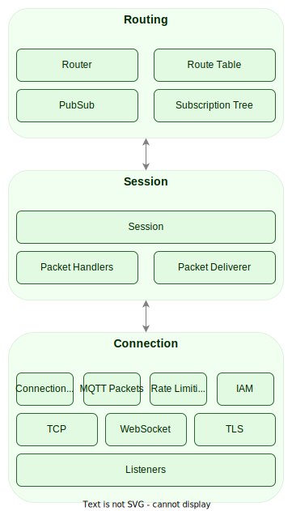

# System Design

> **_NOTE:_**  Consider this document as a draft.

## Overview

The MQTT protocol is the de-facto standard for IoT messaging. Standardized by OASIS and ISO, MQTT protocol provides a
scalable and reliable way to connect devices over the Internet. Today, MQTT is used by many companies to connect
millions of devices to the Internet.

The MQTT protocol is an extremely simple and lightweight messaging protocol designed for limited devices and networks
with high latency, low bandwidth or unreliable networks. It is designed to reduce the network bandwidth and resource
requirements of devices. Using the MQTT protocol, resource-constrained IoT devices can send information to a server, by
publishing on a specific topic, that acts as an MQTT message broker. The broker then transmits the information to those
who have previously subscribed to that topic.

MaxMQ is an open-source, cloud-native, and high-performance message broker for IoT, compliant with the MQTT 3.1, 3.1.1
and 5.0 specifications. In order to be a production-grade message broker, the following characteristics are required:

- High Availability: The system must have low latency and maintain highly available for any operations even if one
  or more nodes are in a failure state, or if there's a network failure.
- High Scalability: The system must scale both vertically (make use of modern multicore, multi-CPU architectures,
  and high-capacity storage devices), as well as horizontally (adding more nodes).
- High Performance: The system must run as close to the hardware as possible to deliver low and consistent latency
  as well as very high throughput.
- High Maintainability: The system must be easy to operate with easy-to-use features that require minimal initial
  configuration.

## Architecture

The architecture of the MaxMQ is divided into different services, where each service is responsible for a group of
functionalities related to a given context. The current architecture contains four services:

- **MQTT Server:** Acts as a front door for IoT devices, allowing those devices to connect using the MQTT protocol.
- **API Server:** Provides an interface to allow external applications to interact with the server.
- **Rule Engine:** Processes IoT data in real-time which can extract, filter, enrich, transform and store those data.
- **Storage Node:** A high-performance and highly-available Key-Value store.

Those services can be deployed all together in a single process, as a monolithic application, or they can be deployed
each service in a separate process, as microservices, to allow each service to scale independently.

The communication between each service are internal API calls, when the caller and the called services are in the same
process, or Remote Procedure Call (RPC) otherwise.

### MQTT Server

The MaxMQ MQTT server is a message broker fully compatible with the MQTT 3.1, 3.1.1 and 5.0 specifications. The MQTT
server implements a layered architecture where the system is contains three layers: Connection, Session, Routing.

#### Connection Layer

The connection layer is responsible for:

- Listen and accept TCP connections
- Read (deserialize) MQTT packets from clients
- Send (serialize) MQTT packets to clients
- Connection management
- Rate limiting connections based on concurrent connections limits
- Rate limiting publications using the Sliding Window Counter algorithm

#### Session Layer

**WIP**

#### Message ID

**WIP**

